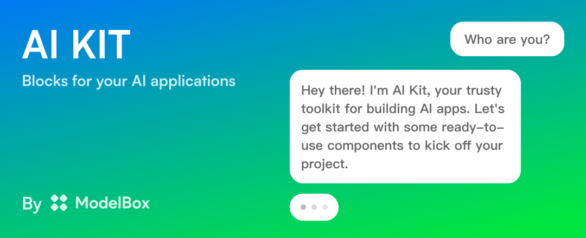

# ModelBox AI SDK

ModelBox AI SDK is a powerful toolkit for rapidly integrating and developing with Large Language Models (LLMs). It provides both UI components and API interfaces, enabling developers to easily incorporate AI capabilities into their applications.

## Features

- 🚀 Quick Integration — Seamlessly connect to popular LLMs with minimal setup.
- 💻 UI & API Support — Flexible options for both frontend and backend integration.
- 🔧 Customizable — Easily adapt the SDK to fit your specific use case and design.
- 📊 Performance Optimized — Built for efficiency and scalability.

and much more...

## Quick Start

**Note: Quick Start guide is currently under development. Installation instructions will be provided soon.**

## Documentation

For comprehensive guidance on using ModelBox AI SDK, please refer to our [official documentation](https://ai-kit.model.box/docs).

## Contribute

We welcome contributions! Please read our [Contribution Guidelines](https://github.com/model-box/ai-kit/blob/main/CONTRIBUTING.md) before submitting any pull requests.

## Stay Updated

Follow [@ModelBoxAI](https://twitter.com/ModelBoxAI) on Twitter for the latest updates and announcements.

## License

ModelBox AI SDK is released under the [Apache License](https://github.com/modelbox/ai-sdk/blob/main/LICENSE).